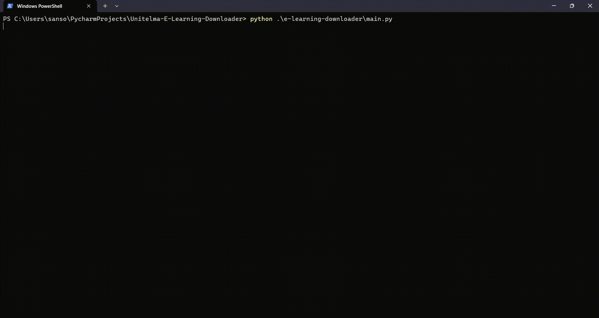

## Project Description

This utility allows students to download videos and attachments from courses on the Unitelma e-learning platform by logging in with their credentials. By downloading the videos, students can watch them offline, which is particularly useful when the platform experiences slowdowns. Additionally, having the videos stored locally allows students to open them with external media players, like VLC, which offer the ability to adjust the playback speed.

This tool is designed to improve the learning experience by providing uninterrupted access to course materials, especially in situations where the platform might be slow or experiencing issues. It ensures students can always access the content, regardless of online availability, and enjoy more control over how they consume the material.



## Requirements

- **Python version**: 3.6 or higher
- You can check your Python version by running:

   ```bash
    python --version
    ```
  
## How to run the project

1. **Clone the repository**:
    ```bash
    git clone https://github.com/username/project-name.git
    cd project-name
    ```

2. **(Optional) Create and activate a virtual environment**:

    ```bash
    python -m venv venv
    venv/Scripts/activate  # On Linux: source venv\bin\activate
    ```

4. **Install the dependencies**:

    ```bash
    pip install -r requirements.txt
    ```
6. **Configure your credentials**:  

   Inside the project folder, there is a file named `config.example.ini`. You need to:

   - Rename `config.example.ini` to `config.ini`.
   - Open `config.ini` and **replace** the placeholder values with your actual Unitelma platform credentials.

    Example of what `config.ini` should look like:
    
    ```ini
    [credentials]
    username = your_actual_username
    password = your_actual_password
   
8. **Run the program from the root directory** (make sure you are in the main project folder):

   ```bash
    python e-learning-downloader/main.py
    ```

   **Optional parameters**:
   
   - `--skip-optional-recordings`: Skips any optional recordings during the process such as Interactive Multimedia Whiteboard (IWB) recordings.
   
     Example usage:
     ```bash
     python e-learning-downloader/main.py --skip-optional-recordings
     ```

   - `--skip-attachments`: Skips processing of any attachments. Use this if you do not want to download attachment files during the scraping process.
   
     Example usage:
     ```bash
     python e-learning-downloader/main.py --skip-attachments
     ```

   - You can also combine both options:
     ```bash
     python e-learning-downloader/main.py --skip-optional-recordings --skip-attachments
     ```

### Notes:

- Make sure to run the program from the root directory as running it from any other directory may cause path or import errors.
